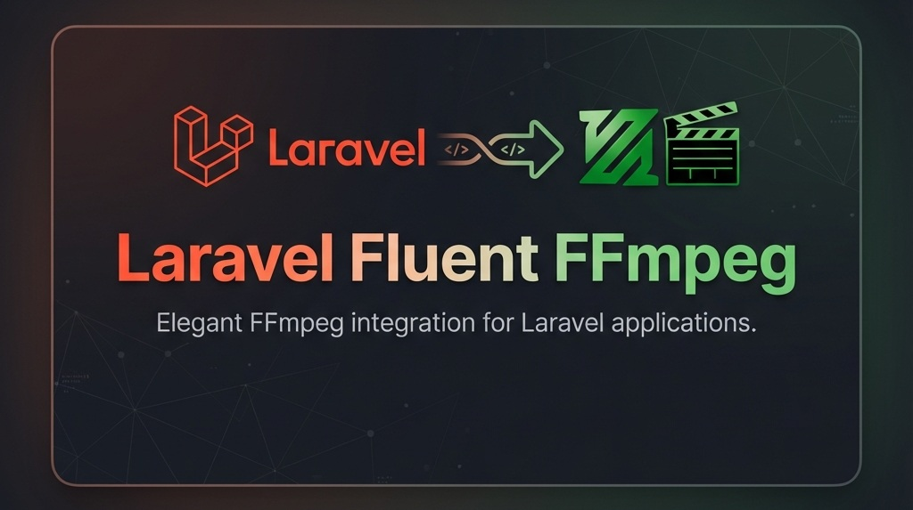

# Laravel Fluent FFmpeg



[](https://packagist.org/packages/ritechoice23/laravel-fluent-ffmpeg)
[](https://github.com/ritechoice23/laravel-fluent-ffmpeg/actions?query=workflow%3Arun-tests+branch%3Amaster)
[](https://github.com/ritechoice23/laravel-fluent-ffmpeg/actions?query=workflow%3A"Fix+PHP+code+style+issues"+branch%3Amaster)
[](https://packagist.org/packages/ritechoice23/laravel-fluent-ffmpeg)
[](https://buymeacoffee.com/ritechoice23)

A fluent, chainable API for working with FFmpeg in Laravel applications. Process videos and audio with an elegant, expressive syntax.

## Installation

```bash
composer require ritechoice23/laravel-fluent-ffmpeg
```

Publish the configuration:

```bash
php artisan vendor:publish --tag=fluent-ffmpeg-config
```

## Quick Start

```php
use Ritechoice23\FluentFFmpeg\Facades\FFmpeg;

// Basic video conversion
FFmpeg::fromPath('video.mp4')
    ->videoCodec('libx264')
    ->audioCodec('aac')
    ->resolution(1920, 1080)
    ->save('output.mp4');

// Or using the global helper
ffmpeg()->fromPath('video.mp4')
    ->videoCodec('libx264')
    ->save('output.mp4');

// Extract audio
FFmpeg::fromPath('video.mp4')
    ->extractAudio()
    ->save('audio.mp3');

// Create GIF
FFmpeg::fromPath('video.mp4')
    ->clip('00:00:05', '00:00:10')
    ->toGif(['fps' => 15, 'width' => 480])
    ->save('animation.gif');

// Advanced HLS Streaming (Multi-bitrate)
FFmpeg::fromPath('video.mp4')
    ->exportForHLS()
    ->addFormat('1080p')
    ->addFormat('720p')
    ->addFormat('480p')
    ->save('stream.m3u8');

// Extract multiple clips
FFmpeg::fromPath('video.mp4')
    ->clips([
        ['start' => '00:00:10', 'end' => '00:00:20'],
        ['start' => '00:01:30', 'end' => '00:02:00'],
        ['start' => '00:03:45', 'end' => '00:04:15'],
    ])
    ->save('highlight.mp4'); // Outputs: highlight_1.mp4, highlight_2.mp4, highlight_3.mp4

// Video composition with intro, outro, and watermark
FFmpeg::fromPath('video.mp4')
    ->withIntro('intro.mp4')
    ->withOutro('outro.mp4')
    ->withWatermark('logo.png', 'bottom-right')
    ->save('branded.mp4');

// Process all videos in a directory
FFmpeg::fromDirectory('/path/to/videos')
    ->resize(1920, 1080)
    ->withWatermark('logo.png', 'top-right')
    ->save('/path/to/output/');

// Add text overlay
FFmpeg::fromPath('video.mp4')
    ->withText('Copyright 2024', [
        'position' => 'bottom-right',
        'font_size' => 24,
        'font_color' => 'white',
        'background_color' => 'black@0.5',
    ])
    ->save('output.mp4');

// Generate audio waveforms for visualization
FFmpeg::fromPath('audio.mp3')
    ->audioCodec('aac')
    ->withPeaks(samplesPerPixel: 512, normalizeRange: [0, 1])
    ->save('output.m4a');
// Outputs: output.m4a + output-peaks.json
```

## Features

-   **Fluent API** - Chainable, expressive syntax
-   **Audio Waveforms** - Generate waveform data for visualization
-   **Multi-Clip Extraction** - Extract multiple clips with auto-numbering
-   **Directory Processing** - Process multiple files from a directory
-   **Text Overlay** - Add styled text with positioning and timing
-   **Video Composition** - Add intro, outro, and watermarks to clips
-   **20+ Filters** - Effects, transformations, overlays
-   **Multiple Formats** - MP4, HLS, DASH, GIF, and more
-   **Media Probing** - Get detailed video/audio information
-   **Laravel Disks** - Save to S3, local, or any disk
-   **Progress Tracking** - Real-time progress with broadcasting
-   **Queue Support** - Process videos in background
-   **Smart Defaults** - Sensible defaults from config
-   **Events** - Track processing lifecycle
-   **Fully Tested** - 215+ passing tests

## Documentation

-   [Installation & Configuration](docs/installation.md)
-   [Basic Usage](docs/basic-usage.md)
-   [Audio Waveforms](docs/audio-waveforms.md) - Generate waveform data for visualization
-   [Directory Processing](docs/directory-processing.md) - Process multiple files from a directory
-   [Text Overlay](docs/text-overlay.md) - Add styled text to videos
-   [Clipping](docs/clipping.md) - Extract single or multiple video clips
-   [Video Composition](docs/video-composition.md) - Add intro/outro/watermark
-   [Media Probing](docs/probe.md) - Get video/audio information
-   [Video Options](docs/video-options.md)
-   [Audio Options](docs/audio-options.md)
-   [Subtitle Options](docs/subtitle-options.md)
-   [Filters & Effects](docs/filters.md)
-   [Format Conversion](docs/format-conversion.md) - Convert to MP3, MP4, WebM, and more
-   [Formats & Streaming](docs/formats.md)
-   [Advanced HLS](docs/hls.md)
-   [Cross-Platform Compatibility](docs/compatibility.md)
-   [Laravel Integration](docs/laravel-integration.md)
-   [Queue Processing](docs/queue.md)
-   [Events & Broadcasting](docs/events.md)
-   [Helper Methods](docs/helpers.md)
-   [Package Lifecycle](docs/lifecycle.md)
-   [API Reference](docs/api-reference.md)

## Requirements

-   PHP 8.2+
-   Laravel 10.0+
-   FFmpeg 4.0+

## Testing

```bash
composer test
```

## Credits

-   [Daramola Babatunde Ebenezer](https://github.com/ritechoice23)

## License

The MIT License (MIT). Please see [License File](LICENSE.md) for more information.
