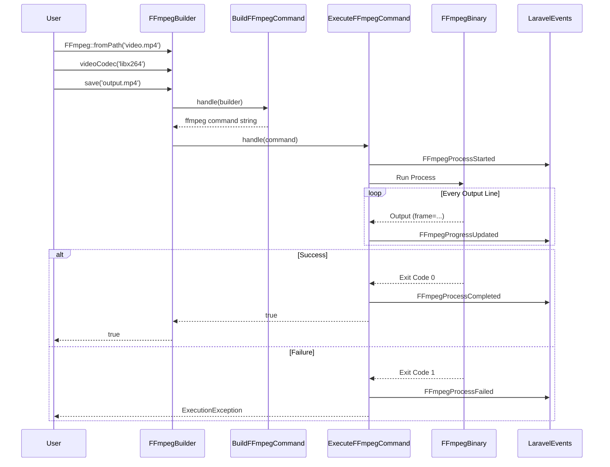

# Package Lifecycle

This document explains the internal lifecycle of a Laravel Fluent FFmpeg operation, from the initial method call to the final file export. Understanding this flow helps in debugging and extending the package.

## 1. Initialization Phase

The process begins when you call `FFmpeg::fromPath()`.

```php
$builder = FFmpeg::fromPath('video.mp4');
```

-   **Facade Call**: The `FFmpeg` facade resolves to the `FFmpegBuilder` class.
-   **Builder Creation**: A new instance of `FFmpegBuilder` is created.
-   **Input Handling**: The input path is normalized. If it's a Laravel disk path or URL, it's prepared for processing.

## 2. Configuration Phase (The Fluent Chain)

As you chain methods, you are modifying the internal state of the `FFmpegBuilder`. No FFmpeg commands are executed yet.

```php
$builder->videoCodec('libx264')
        ->resolution(1920, 1080)
        ->onProgress(fn($p) => ...);
```

-   **Option Storage**: Methods like `videoCodec` store values in the `$outputOptions` array.
-   **Filter Registration**: Methods like `watermark` add filter objects to the `$filters` array.
-   **Callback Registration**: Progress and error callbacks are stored in properties.

## 3. Command Building Phase

When you call a terminal method like `save()`, `output()`, or `exportForHLS()`, the package prepares the command.

```php
$builder->save('output.mp4');
```

-   **Action Invocation**: The `BuildFFmpegCommand` action is called.
-   **Option Compilation**: The builder's state (inputs, options, filters) is converted into a raw FFmpeg command string.
-   **Smart Defaults**: If options are missing (e.g., no video codec specified), the builder applies defaults from `config/fluent-ffmpeg.php`.
-   **Filter Graph**: Complex filters are assembled into a filter graph string (e.g., `[0:v]scale=1920:1080[v1];[v1]overlay=10:10`).

**Example Generated Command:**

```bash
ffmpeg -y -i "input.mp4" -c:v libx264 -s 1920x1080 "output.mp4"
```

## 4. Execution Phase

The command is handed over to the `ExecuteFFmpegCommand` action.

-   **Process Start**: A `Symfony\Process` instance is created and started.
-   **Event Dispatch**: `FFmpegProcessStarted` event is dispatched.
-   **Monitoring**: The package monitors the process output (stdout/stderr) in real-time.

### Progress Tracking

As FFmpeg outputs status lines (e.g., `frame= 120 fps= 24...`), the package:

1. Parses the output to calculate percentage, speed, and remaining time.
2. Invokes any registered `onProgress` callbacks.
3. Dispatches `FFmpegProgressUpdated` events (if broadcasting is enabled).

## 5. Completion Phase

Once the process finishes:

-   **Success**:
    -   `FFmpegProcessCompleted` event is dispatched.
    -   The method returns `true`.
-   **Failure**:
    -   `FFmpegProcessFailed` event is dispatched.
    -   An `ExecutionException` is thrown (unless caught by `onError`).
    -   The exception contains the full command output for debugging.

## Lifecycle Diagram



## HLS Export Lifecycle

The `exportForHLS()` method follows a slightly different "Multi-Pass" lifecycle:

1. **Analysis**: `HlsExporter` analyzes the requested formats (1080p, 720p, etc.).
2. **Loop**: For each format:
    - It clones the original Builder.
    - It overrides resolution, bitrate, and profile settings.
    - It runs the standard **Command Building** and **Execution** phases for that specific variant.
3. **Master Playlist**: After all variants are generated, it creates the master `.m3u8` file linking them together.
